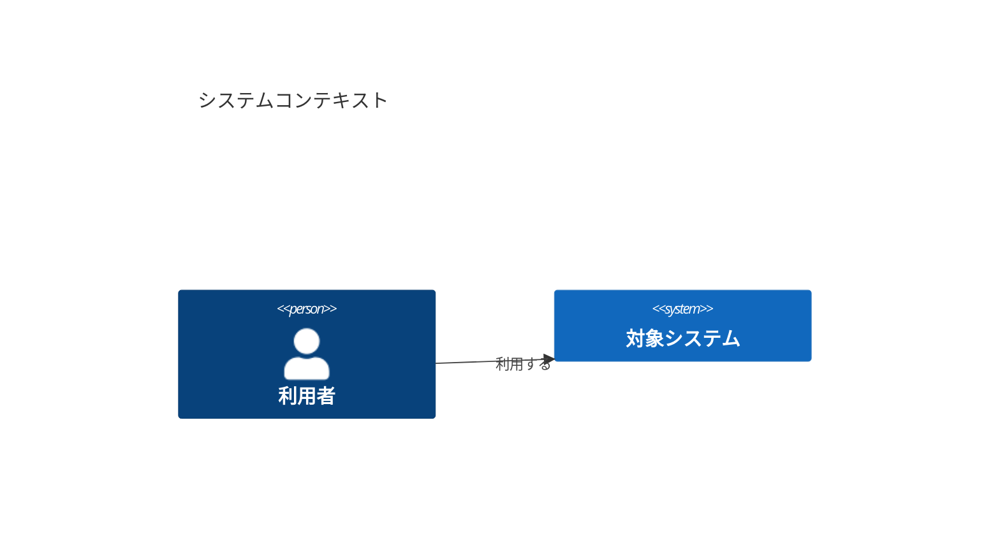

# arc42 / C4 / ADR documentation template

汎用的なソフトウェアアーキテクチャ文書を、同じMarkdownソースから次の形式へ出力するテンプレートです。

- MkDocsによるWebサイト
- Pandocで生成したHTMLをWeasyPrintで印刷する単一PDF
- GraphvizのDOTから生成する編集可能な構成図

サンプルは架空の「対象システム」を使い、特定企業、クラウド、製品、業務ドメインには依存していません。

## クイックスタート

### Webプレビュー

```bash
docker compose up --build docs
```

ブラウザで `http://localhost:8000/` を開きます。

### 静的サイト生成

```bash
docker compose run --rm --build site
```

出力先は `site/` です。

### PDF生成

```bash
docker compose run --rm --build pdf
```

出力先は次のとおりです。

```text
build/architecture-document.pdf
build/architecture-document.html
build/architecture-combined.md
```

### すべて生成して検証

```bash
docker compose run --rm --build verify
```

## 構成

```text
.
├── compose.yaml
├── Dockerfile
├── Makefile
├── mkdocs.yml
├── docs/                       # Markdownの正本
├── diagrams/                   # Graphviz DOTの図面ソース
├── pdf/
│   ├── config.yml              # PDFタイトル、余白、出力名
│   ├── print.css               # PDF印刷スタイル
│   ├── template.html           # Pandoc HTMLテンプレート
│   └── build_pdf.py            # nav取得、連結、HTML/PDF生成
├── scripts/
│   ├── build-diagrams.sh
│   ├── check-pdf-toolchain.sh
│   ├── build-site.sh
│   ├── build-pdf.sh
│   ├── build-all.sh
│   └── verify.sh
├── LICENSE.md
├── LICENSES/
├── NOTICE.md
└── PUBLICATION_CHECKLIST.md
```

## 文書を編集する

1. `docs/` のMarkdownを編集します。
2. ページを追加した場合は `mkdocs.yml` の `nav` に追加します。
3. 図を変更する場合は `diagrams/*.dot` を編集します。
4. `docker compose run --rm --build verify` を実行します。

PDFの章順は `mkdocs.yml` の `nav` を正とするため、目次を二重管理しません。

## 図を再生成する

```bash
docker compose run --rm --build diagrams
```

生成されたPNGは `docs/assets/images/` に配置されます。DOTファイルが編集可能な原本です。

## Mermaidで図を書く

Markdown内に ` ```mermaid ` コードブロックを書くと、C4（`C4Context` など）を含むMermaid図をそのまま記載できます。



- Webサイト（MkDocs）: ブラウザ側でMermaidを描画します。
- PDF: WeasyPrintはJavaScriptを実行しないため、ビルド時に `mermaid-cli`（`mmdc`）で各ブロックをPNGへ変換し、`build/mermaid/` に出力して埋め込みます。

Graphviz DOTによる図（`diagrams/*.dot`）も従来どおり併用できます。用途に応じて使い分けてください。

## PDFの見た目を変更する

- 文書固有の値: `pdf/config.yml`
- 紙面レイアウト: `pdf/print.css`
- HTML全体: `pdf/template.html`

LaTeX、XeLaTeX、TeX Liveは使用しません。

## 公開前に変更する項目

- `mkdocs.yml` の `site_url` と `repo_url`
- `pdf/config.yml` のタイトル、著者、ヘッダー
- `LICENSES/MIT.txt` の著作権表示
- READMEやNOTICEのプロジェクト名
- `[記入]`、`[リンク]`、サンプル値

詳細は [PUBLICATION_CHECKLIST.md](PUBLICATION_CHECKLIST.md) を参照してください。

## ライセンスと帰属

- `docs/`、`diagrams/`、サンプル画像などの文書コンテンツ: CC BY-SA 4.0
- Docker、Python、Shell、CSSなどのビルドコード: MIT

文書構造は **arc42** を参考にしています。arc42はGernot Starke氏とPeter Hruschka氏によるもので、CC BY-SA 4.0で提供されています。図の粒度にはSimon Brown氏による **C4 model** の考え方を利用しています。詳細は [NOTICE.md](NOTICE.md) と [LICENSE.md](LICENSE.md) を参照してください。

## 免責

このリポジトリはテンプレートです。サンプル値は要件、契約、セキュリティ基準としてそのまま使用せず、対象システムに合わせてレビューしてください。
