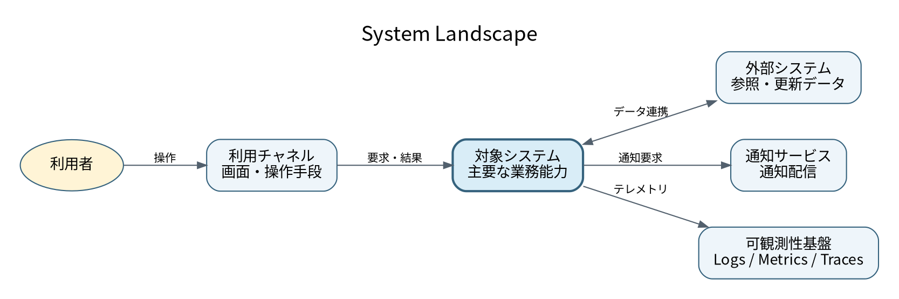
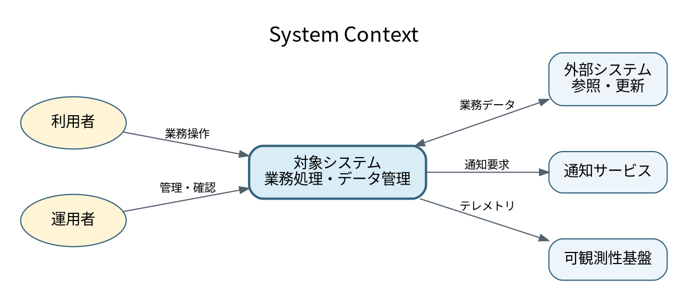

# 3. コンテキストとスコープ

## 3.1 System Landscape

対象システムを含む周辺システム全体を俯瞰し、所有者と変更範囲を確認する。

| システム | 役割 | 所有者 | 今回の対象 | 主な変更 |
|---|---|---|---:|---|
| 対象システム | 主要な業務能力を提供する | [記入] | ○ | [新規構築・改修] |
| 利用チャネル | 利用者へ画面または操作手段を提供する | [記入] | [○/△/対象外] | [記入] |
| 外部システム | 参照情報または処理結果を提供する | [記入] | 対象外 | 連携条件の調整 |
| 通知サービス | 利用者や運用者へ通知する | [記入] | 対象外 | 接続設定 |
| 可観測性基盤 | ログ、メトリクス、トレースを保管する | [記入] | 対象外 | 受信設定 |

## 3.2 System Context

対象システムを一つの黒い箱として、利用者と外部システムとの関係を示す。

## 3.3 外部インターフェース一覧

| IF-ID | 相手 | 目的 | 入出力 | 想定方式 | データの正 | Owner |
|---|---|---|---|---|---|---|
| IF-001 | 利用チャネル | 業務操作 | 要求、結果 | HTTPS / [記入] | 対象システム | [記入] |
| IF-002 | 外部システム | 参照・更新 | 業務データ | API / File / Event | [記入] | [記入] |
| IF-003 | 通知サービス | 通知配信 | 通知要求、結果 | API / Queue | 対象システム | [記入] |
| IF-004 | 可観測性基盤 | 運用監視 | Logs / Metrics / Traces | Agent / API | 可観測性基盤 | [記入] |

正確な項目、URI、Schema、再試行条件は[外部IF台帳](interfaces/external-interface-register.md)と個別の契約仕様を正とする。

## 3.4 責任境界

- **利用者入力の検証**: [担当する要素]
- **業務ルールの最終判断**: [担当する要素]
- **データの正**: [データごとの所有システム]
- **外部連携の変換・再試行**: [担当する要素]
- **監査証跡の長期保管**: [担当する基盤]
- **障害時の一次対応**: [担当チーム]
