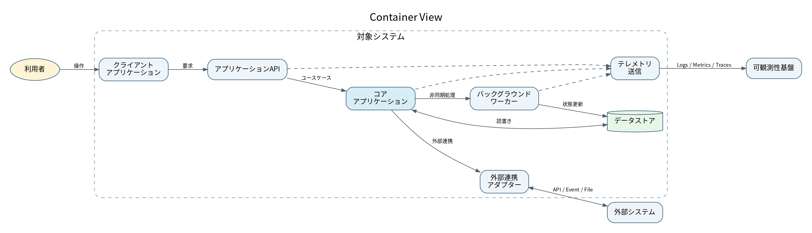

# 5. ブロックビュー

対象システム内部の静的な分割、責務、依存関係を示す。

## 5.1 レベル1: コンテナビュー

| ID | Building Block / Container | 責務 | Owner | 所有データ | 主なIF |
|---|---|---|---|---|---|
| CNT-UI | クライアントアプリケーション | 利用者操作、入力補助、結果表示 | [記入] | 一時状態 | HTTPS |
| CNT-API | アプリケーションAPI | 入力検証、ユースケース受付、応答整形 | [記入] | なし | HTTP API |
| CNT-CORE | コアアプリケーション | 業務ルール、トランザクション制御 | [記入] | 業務データ | Internal API |
| CNT-WORKER | バックグラウンドワーカー | 非同期処理、再試行、定期処理 | [記入] | 処理状態 | Queue / Event |
| CNT-DATA | データストア | 業務データの永続化 | [記入] | 業務データ | Database Protocol |
| CNT-ADAPTER | 外部連携アダプター | 外部形式の変換、再試行、障害隔離 | [記入] | 連携状態 | API / File / Event |
| CNT-TELEMETRY | テレメトリ送信 | Logs、Metrics、Tracesの送信 | [記入] | 一時バッファ | Telemetry Protocol |

## 5.2 Level 2: 重要部分の展開

詳細化が必要なBuilding BlockだけをComponent相当へ展開する。

- ユースケースサービス
- ドメインルール
- リポジトリまたはデータアクセス
- 外部連携クライアント
- ジョブスケジューラー
- イベントハンドラー
- 監査記録

各Componentについて次を記載する。

| 項目 | 記載内容 |
|---|---|
| 責務 | 何をし、何をしないか |
| 入出力 | 主要なIFとデータ |
| 依存 | 利用するComponent・外部システム |
| 障害影響 | 停止時に影響する機能 |
| セキュリティ境界 | 機密情報・管理権限の扱い |
| 関連ADR | 重要な構造判断 |

## 5.3 データ所有権

| データ | 正を持つ要素 | 複製・参照先 | 更新方式 |
|---|---|---|---|
| 基本情報 | [外部システムまたは対象システム] | [記入] | API / Event / File |
| 業務データ | コアアプリケーション | 検索・分析用途の複製先 | Transaction / Event |
| 処理状態 | バックグラウンドワーカー | 運用監視 | Queue / Checkpoint |
| 監査イベント | 監査・可観測性基盤 | 長期保管先 | 非同期転送 |

!!! note "詳細化の基準"
    セキュリティ上重要、複数チームが担当、障害影響が大きい、または内部責務が複雑な部分だけをLevel 2以降へ展開する。
