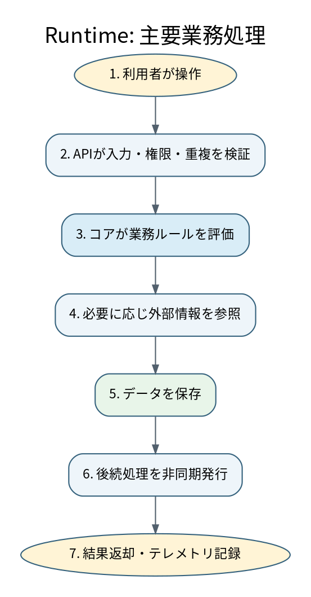

# 6. ランタイムビュー

重要な正常系・異常系シナリオについて、Building Block間の相互作用を示す。

## 6.1 主要業務処理

| 項目 | 内容 |
|---|---|
| シナリオID | RT-CORE-001 |
| 目的 | 利用者の要求を検証し、主要な業務処理を完了する |
| 事前条件 | 利用者が必要な権限を持ち、外部依存が利用可能である |
| 開始条件 | 利用者がクライアントアプリケーションから操作を実行する |
| 完了条件 | データが保存され、結果と監査イベントが記録される |
| 関連要件 | REQ-FUNC-001、Q-REL-001 |

### 正常フロー

1. クライアントアプリケーションが要求を送信する。
2. アプリケーションAPIが形式、権限、重複を検証する。
3. コアアプリケーションが業務ルールを評価する。
4. 必要に応じて外部連携アダプターが外部システムを参照する。
5. コアアプリケーションがデータストアへ結果を保存する。
6. 後続処理が必要な場合、非同期メッセージを発行する。
7. APIが結果を返し、テレメトリを記録する。

## 6.2 非同期処理

次を明示する。

- メッセージを発行する条件
- 冪等性を保証するキー
- 再試行回数とBackoff
- 処理不能メッセージの隔離先
- 順序保証の必要性
- 重複・遅延・欠落の検知方法

## 6.3 データ更新と整合性

- トランザクション境界
- 外部システム更新との整合性
- 補償処理または再実行方法
- 同時更新時の競合解決
- 読み取りモデルの更新遅延

## 6.4 異常系一覧

| ID | シナリオ | 期待動作 | Runbook |
|---|---|---|---|
| RT-ERR-001 | 外部システム停止 | Timeout後に安全に失敗し、再試行または縮退方針へ従う | RUN-EXT-001 |
| RT-ERR-002 | データストア接続失敗 | 更新を確定せず、影響を検知して通知する | RUN-DATA-001 |
| RT-ERR-003 | メッセージ処理失敗 | 再試行後に隔離し、再処理可能な状態を維持する | RUN-MSG-001 |
| RT-ERR-004 | テレメトリ送信失敗 | 業務処理を不必要に停止せず、欠落を検知する | RUN-OBS-001 |
| RT-ERR-005 | 重複要求 | 冪等性キーにより二重更新を防止する | RUN-APP-001 |
