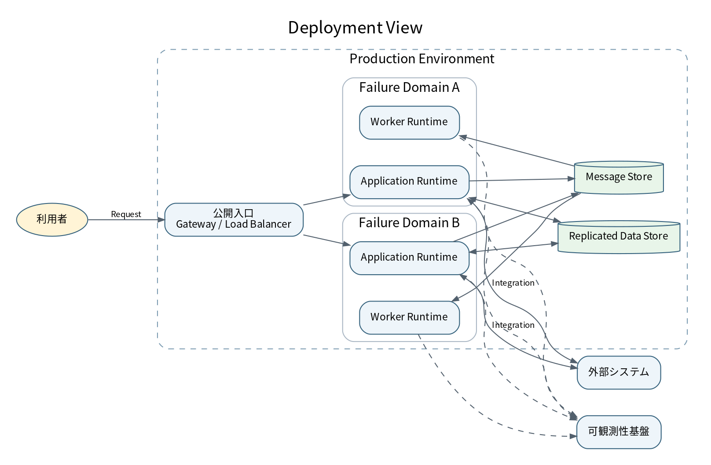

# 7. デプロイメントビュー

## 7.1 論理配置

## 7.2 配置要素

| レベル | 記載するもの |
|---|---|
| Environment | 開発、検証、本番などの環境境界 |
| Failure Domain | データセンター、ゾーン、ノードなどの障害境界 |
| Network | 公開・非公開境界、接続経路、管理面 |
| Runtime | Containerを配置する実行ノードまたはプラットフォーム |
| Data | データストア、バックアップ、レプリカ |
| Security | 秘密情報、鍵、証明書、境界防御の責務 |
| Observability | Logs、Metrics、Tracesの送信先 |

## 7.3 ブロックビューとの対応

| Container ID | 配置先 | 冗長化 | Stateful | 復旧方針 |
|---|---|---|---:|---|
| CNT-UI | 配信・実行ノード | [記入] | なし | 再配布 |
| CNT-API | アプリケーション実行ノード | 複数障害領域 | なし | 自動再配置 |
| CNT-CORE | アプリケーション実行ノード | 複数障害領域 | なし | 自動再配置 |
| CNT-WORKER | ワーカー実行ノード | 複数障害領域 | 一部 | Checkpointから再実行 |
| CNT-DATA | データノード | レプリケーション | あり | バックアップ・復元 |

## 7.4 環境差分

| 項目 | 開発 | 検証 | 本番 |
|---|---|---|---|
| 規模 | 最小 | 本番相当の一部 | 要求に基づく |
| 冗長化 | 任意 | 主要経路を確認 | 品質要件を満たす |
| 外部接続 | Stub / Sandbox | 検証先 | 本番先 |
| データ | 合成データ | 匿名化・マスク | 本番データ |
| 監視 | 基本 | 本番相当 | 完全 |

## 7.5 正の情報源

arc42には人が理解する論理配置を記載する。次の詳細は複製しない。

- 正確なリソースとパラメータ: Infrastructure as Code
- ネットワーク・アクセス制御の詳細: 構成定義
- 監視閾値: 監視台帳
- 実リソース識別子: Inventory
- 秘密情報: Secret管理システム
