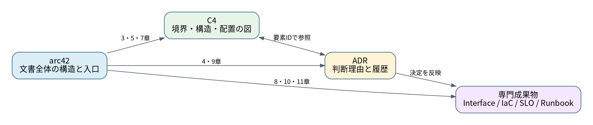

# arc42 / C4 / ADR 統合テンプレート

## このテンプレートの目的

このサイトは、特定の企業、クラウド、製品、業務ドメインに依存せず、次の成果物を一貫して管理するためのひな型です。

- **arc42**: アーキテクチャ全体の説明と詳細資料への入口
- **C4**: システム境界、内部構造、配置の可視化
- **ADR**: 重要な設計判断と理由の履歴
- **インターフェース仕様**: 正確なシステム間契約
- **SLO / Runbook / 脅威モデル**: 品質、運用、セキュリティの専門資料

## サンプルの前提

このテンプレートでは、架空の対象システムを次の抽象要素で表現します。

- 利用者がクライアントアプリケーションを操作する
- 対象システムが主要な業務処理を実行する
- 外部システムとデータを交換する
- データストアへ情報を保存する
- 非同期ワーカーがバックグラウンド処理を行う
- 可観測性基盤へログ、メトリクス、トレースを送る

実際のプロジェクトでは、要素名、責務、制約、品質目標を置き換えてください。

## 文書の読み方

| 読者 | 最初に読むページ |
|---|---|
| 事業責任者・発注担当 | 1、3、10、11章 |
| 開発チーム・アーキテクト | 2〜10章、ADR |
| セキュリティ担当 | 3、6、8、10、11章、脅威モデル |
| 運用担当 | 2、7、8、10、11章、Runbook |
| システム連携担当 | 3、5、6、8章、連携プロファイル |

## 文書状態

| 項目 | 値 |
|---|---|
| 文書Owner | [記入] |
| ステータス | Draft / Review / Approved / Deprecated |
| 対象バージョン | [記入] |
| 最終レビュー日 | YYYY-MM-DD |
| 次回レビュー日 | YYYY-MM-DD |

!!! warning "テンプレートの扱い"
    `[記入]` と書かれた箇所は対象システム固有の情報へ置き換えてください。サンプル値を要件、契約値、セキュリティ基準としてそのまま採用しないでください。

## 帰属

章立てはarc42を参考にしています。図の粒度にはC4 modelの考え方を利用しています。詳細はリポジトリの `NOTICE.md` と `LICENSE.md` を参照してください。
