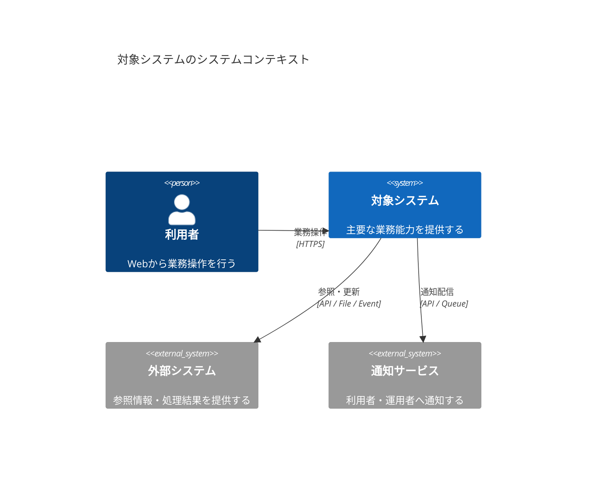
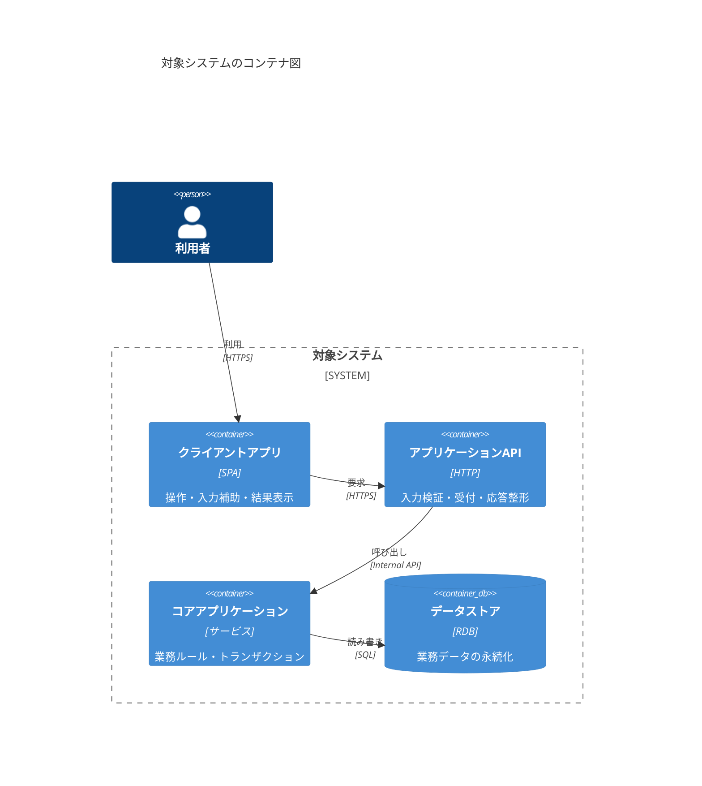
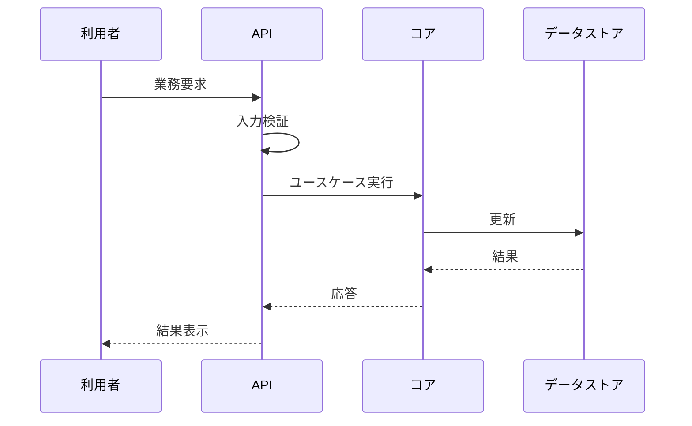
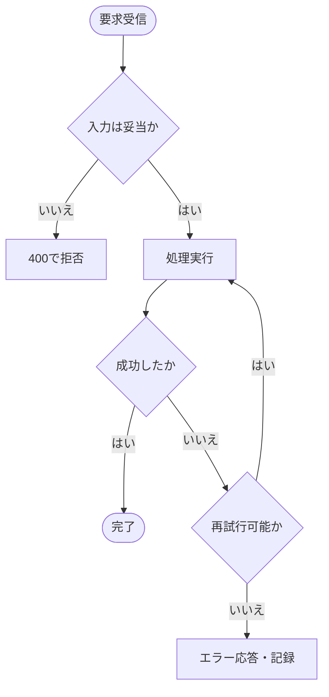

# Mermaidサンプル

このページは、Markdownの ` ```mermaid ` ブロックでC4を含む各種図を記載できることを示すサンプルです。
WebサイトではブラウザがMermaidを描画し、PDFではビルド時に画像へ変換して埋め込みます。

## C4: システムコンテキスト図



## C4: コンテナ図



## シーケンス図（ランタイムビュー）



## フローチャート（異常系の判断）


